# Uduppi-Sagar
> #### An Online Restaurant Management System based on Servlets, JDB and MySQL. 
## Features
- [x] Authentication and Authorization
- [x] Menu Management
- [x] Shopping Cart
- [x] Order Management
- [x] User Profile Maintanence
- [x] Cart Management
- [x] Payment Gateway

## Supported Languages
* Java
* JavaServer Pages (JSP)
* HTML
* CSS
* MySQL

## Prerequisite
+ Java Development Kit (JDK)
+ MySQL Database
+ Servlet Container

## Snapshots

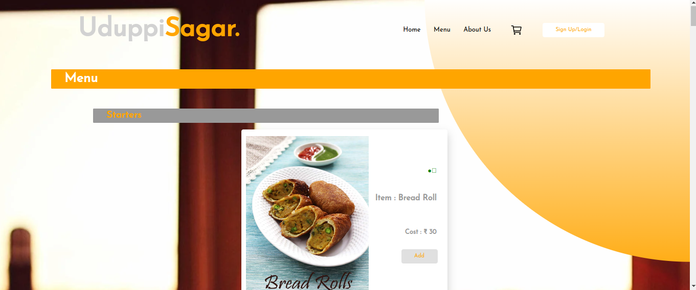
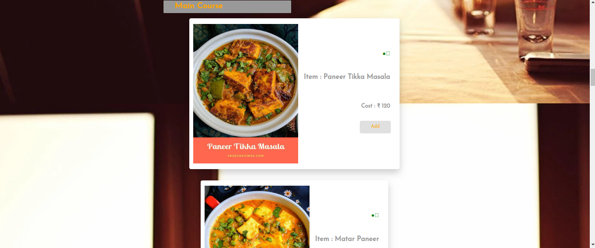
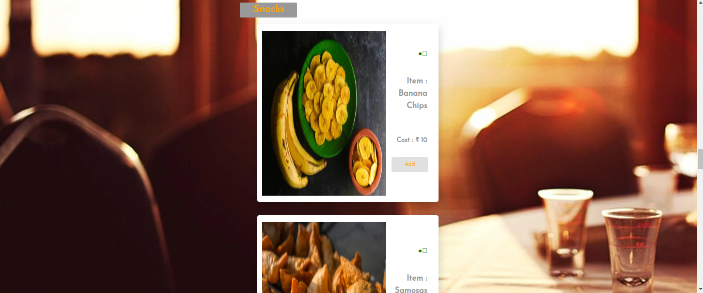
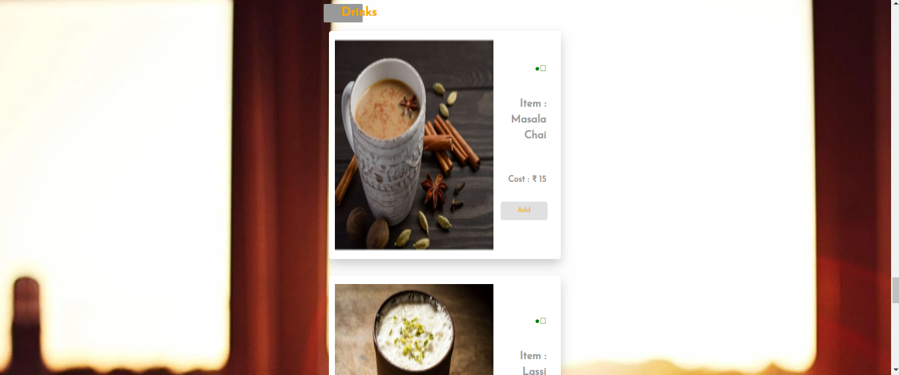
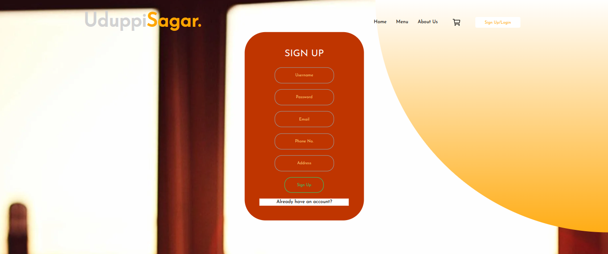
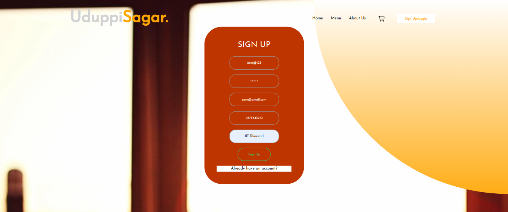
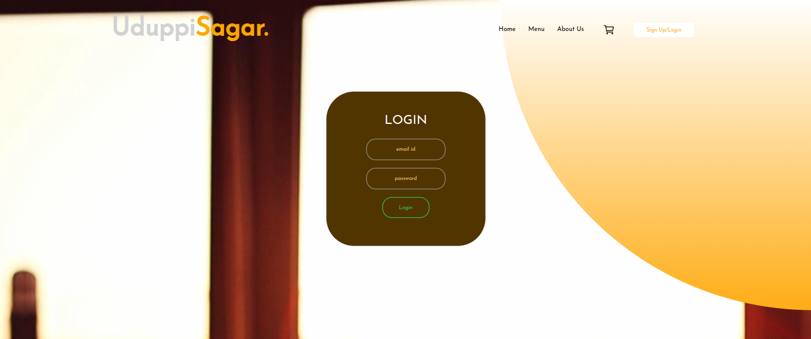

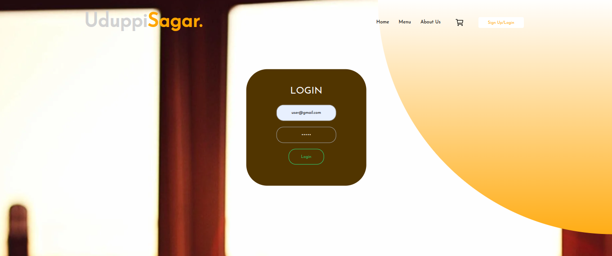

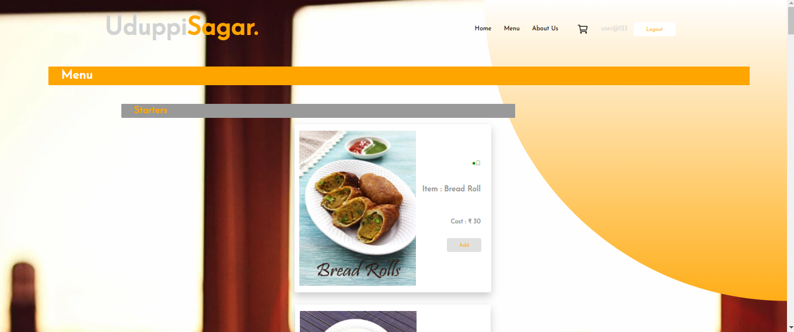
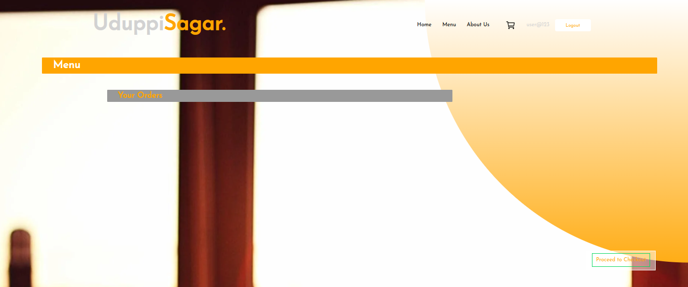
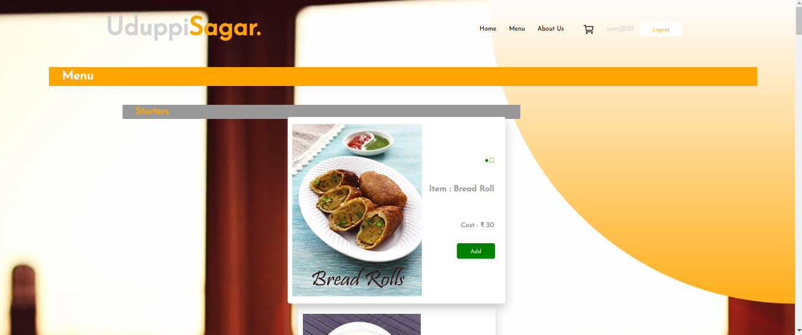
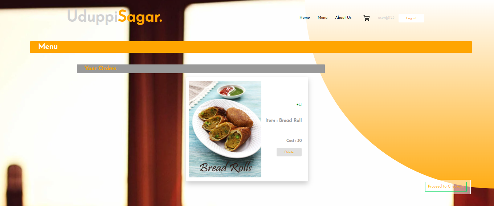
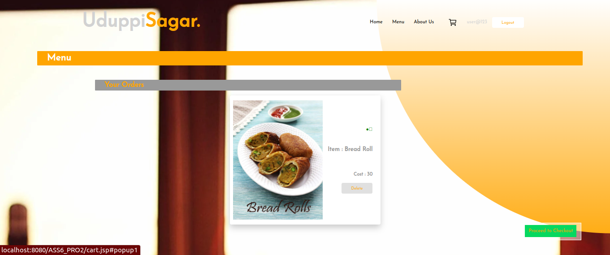
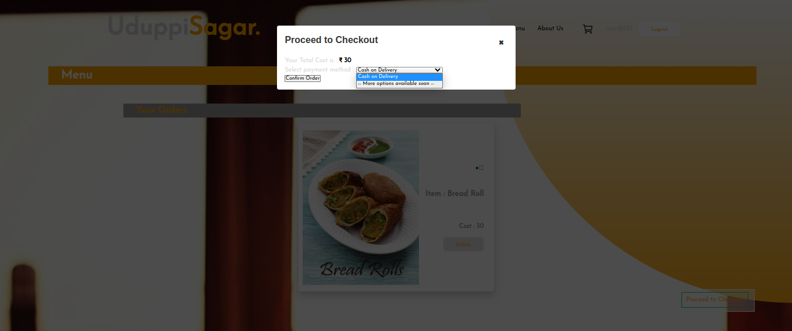

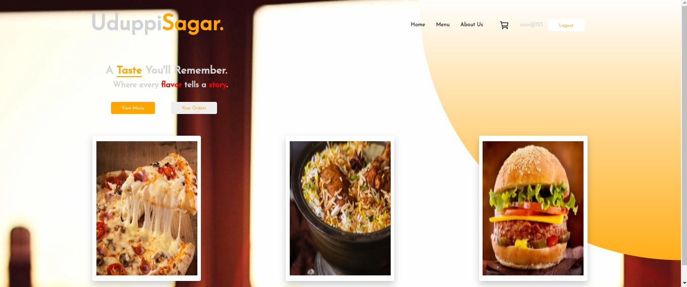
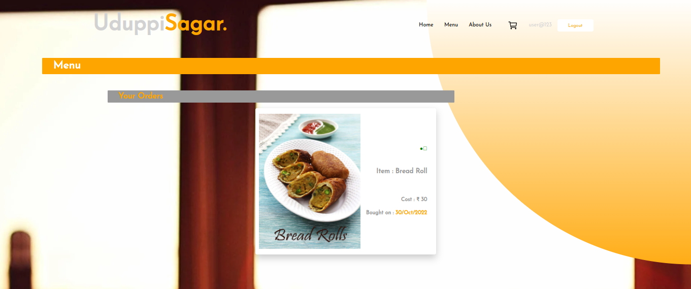
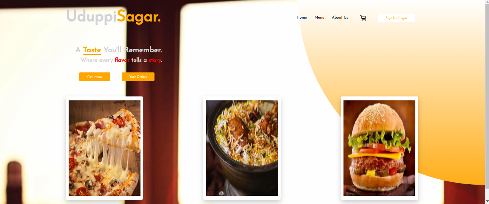

## Thanks
+ I'd appreciate a star if you find this helpful.
+ Feel free to raise an issue if you find any bug.
